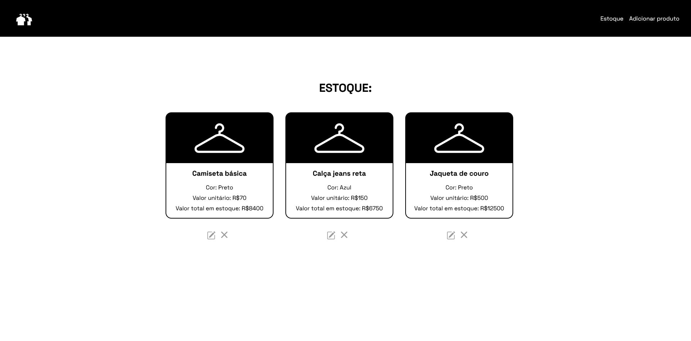
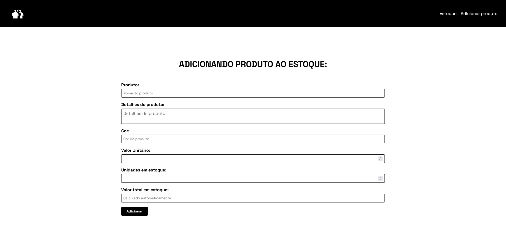
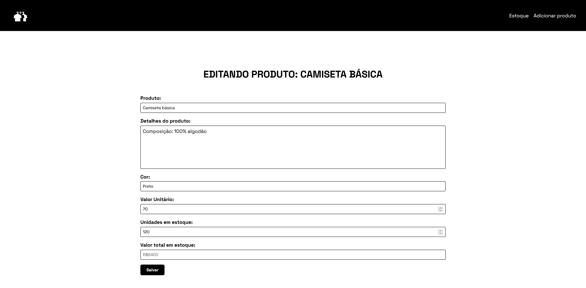

# cadastro-produto

This is a project developed for the Web Programming subject of the Systems Analysis and Development course. The goal was to create a basic CRUD (Create, Read, Update, Delete) system with a registration process (for items, people, products, or similar).
You can check out the layout design bellow.

- Stock page

- Adding new product

- Editing product

## Technologies

This project was developed using the following technologies:
- Node JS
- NPM (modules)
  - Express
  - Express-handlebars
  - MySQL2
  - Sequelize
  - Nodemon
